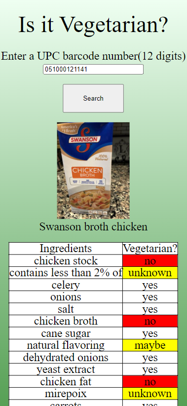

# Is it Vegeterian? - Food Checker

Many of my Indian friends are Vegeterian, so I made this app to help them in their grocery shopping. An app where you can input the barcode number and it returns a table with all the items and whether they are vegeterian or not.

**Link to project:** https://brianbud.github.io/food-checker/

## How It's Made:

**Tech used:** HTML, CSS, JavaScript

I used the [Open Food Facts](https://world.openfoodfacts.org/) API as the food products database to grab the values from the ingredients, img, and vegeterian properties.

An alert will be prompted if the input is not 12 characters and if the JSON message is null.

Once the input is valid, a for...in loop will insert new cells under the Ingredients and Vegeterian table header with the TableRow.insertCell() method.

A for...in loop will also append the keys of the object and properties we want to extract and place it inside the cell, this is done with the appendChild() and properties.keys() method.

A classList will be added to any of the key's values and select the appropriate css class to change it's background color to either red or yellow.

## Optimizations

Later on, I would love to improve the style and let users users use the device's camera to scan the barcode instead of manually inputting the info.

## Lessons Learned:
